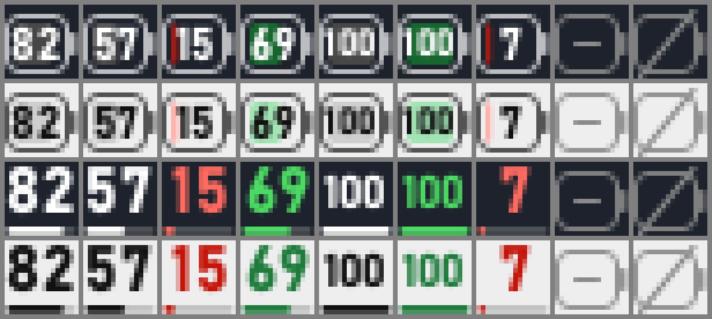
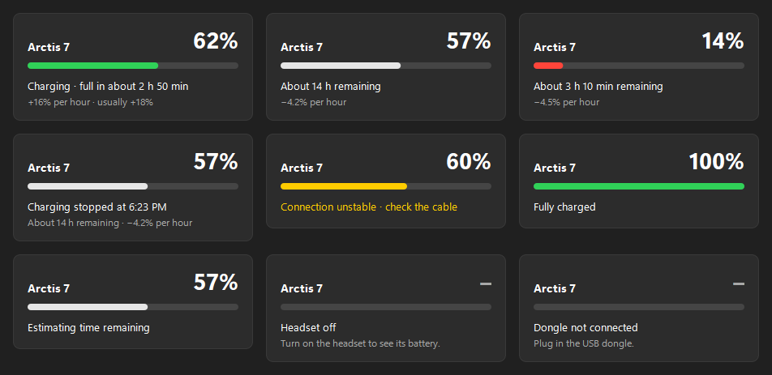

# Arctis Battery

A Windows tray icon that shows the battery level of a SteelSeries Arctis 7
wireless headset, tells you when it's actually charging, and estimates how
long until it's empty or full.



*Tray icon at actual size (enlarged 8×): two styles, dark and light taskbars.
Normal, low, charging, full, headset off, dongle unplugged.*



*Click the icon for details.*

## Why

The headset's official app shows the battery buried in a window, and the
headset's charging LED can't be trusted with a loose cable: it can light up
without current flowing. This app reads the level straight from the USB
dongle every 2 seconds and only shows "charging" when the battery is really
taking a charge.

## Features

- Battery percentage in the tray icon itself, no hover needed. Two styles: a
  battery with the number inside, or a large number with a level bar.
- Charging detection that reacts to real current, not the LED, with a
  warning when the connection keeps dropping ("check the cable").
- Corrected percentage while charging (see [How it works](#how-it-works)).
- Time remaining and drain rate on battery; time to full and charge rate
  while charging, with your usual charge rate for comparison (a slow cable
  or charger stands out).
- Follows the Windows light/dark taskbar theme and display scaling.
- Starts with Windows, survives dongle unplugs, sleep, and restarts.

## Compatibility

| | |
|---|---|
| Tested | SteelSeries Arctis 7 (2019), USB dongle ID `1038:12AD`, Windows 11 |
| Probably works | Windows 10 |
| Unknown | Other Arctis models, including the 2017 Arctis 7 (`1038:1260`) |

To check your dongle's ID: Device Manager → Sound, video and game
controllers → Arctis 7 Game → Properties → Details → Hardware Ids. Look for
`VID_1038&PID_12AD`. Other models may use a different command; if you try
one, `tools\probe.py` prints the raw reply.

## Install

1. Install [Python](https://www.python.org/downloads/) 3.10 or newer.
   During setup, tick **Add python.exe to PATH**.
2. Download this repository: the green **Code** button → **Download ZIP**,
   then extract it somewhere permanent (for example `Documents\arctis-battery`).
   The app runs from this folder, so don't delete it afterwards.
   (Or, with git: `git clone https://github.com/shoepack/arctis-battery-tray.git`.)
3. Open the extracted folder, click the address bar, type `powershell`, and
   press Enter. In the window that opens, run:

   ```powershell
   powershell -ExecutionPolicy Bypass -File install.ps1
   ```

   This sets up a private Python environment in the folder, installs the
   libraries, builds `ArctisBattery.exe`, and starts it. It takes a minute
   or two. (`-ExecutionPolicy Bypass` applies to this one script only;
   Windows blocks downloaded scripts by default.)
4. The icon may start hidden under the **^** arrow in the taskbar. Drag it
   next to the clock to keep it visible.

## Using it

- **Hover** for a one-line summary.
- **Click** for the card: level, charging status, time left, and rate.
- **Right-click** for: Refresh now, Icon style, Start with Windows, Quit.

Estimates need a little history: time to full appears after a few minutes of
charging, time remaining after 30-60 minutes of use. Rates are remembered
across restarts.

## How it works

The dongle exposes a vendor HID interface (usage page `0xFF43`). Writing
`06 18` returns a report whose third byte is the battery percentage. There is
no charging flag, so charging is inferred:

- The headset estimates charge from battery voltage, and a charger lifts that
  voltage. So the reported level **jumps about 4-5 points** within seconds of
  a charger delivering current, and drops the same amount when it stops. A
  jump of 3 or more points flips the charging state. A sustained rise is the
  fallback when charging began before the app was running.
- That jump is also an error: while charging, the headset reads about 5
  points high. The app subtracts the offset measured at plug-in, fading it to
  zero at 100% (charging current, and so the error, tapers toward full), so
  the number doesn't leap when you plug in or unplug. Each unplug measures the
  real offset at that level and refines the value used next time.
- Rates are measured between level changes rather than raw samples, which
  avoids the 1% quantization, and the 1-point bounce voltage gauges produce is
  filtered out.

The headset updates its reported level only every 12-15 seconds, so expect
about 15-20 seconds between plugging in and the icon turning green.

`ArctisBattery.exe` is a small supervisor that runs the tray app as a child
process (`--child`) and restarts it within seconds if it ever exits other
than through Quit, so a crash or a Windows "not responding" close doesn't
leave you without the icon. Two processes in Task Manager is expected.

Code map: `arctis_tray/device.py` (HID), `tracker.py` (charging detection,
correction, estimates), `icons.py`, `card.py`, `app.py` (tray, polling,
supervisor).

## Updating

Download the new version into the same folder (or `git pull`), then run the
install command again. It stops the running copy, rebuilds, and restarts it.

## Uninstall

1. Right-click the icon → untick **Start with Windows** → **Quit**.
2. Delete the folder, and `%APPDATA%\ArctisBatteryTray` (settings, learned
   rates, and a small log).

## Troubleshooting

- **Icon shows a crossed-out battery:** the dongle isn't detected. Try
  another USB port.
- **Icon shows a dash:** the dongle is connected but the headset is off or out
  of range.
- **Charging turns green late or not at all:** see the delay note above. A
  loose cable can light the headset's LED without charging; the icon stays
  white in that case.
- **Doesn't start when you sign in:** check Settings → Apps → Startup and
  make sure ArctisBattery is On. (Versions before October 2026 wrote only the
  Run entry, which current Windows 11 skips; launching the app once fixes it.)
- **Anything else:** check `%APPDATA%\ArctisBatteryTray\app.log`.

## Development

```powershell
.venv\Scripts\python.exe -m pytest tests      # tracker tests
.\build.ps1                                   # tests + build dist\ArctisBattery
.venv\Scripts\pythonw.exe run.pyw             # run from source
.venv\Scripts\python.exe tools\preview_icons.py 16   # icon sheet -> tools\
.venv\Scripts\python.exe tools\preview_card.py dark  # card sheet -> tools\
.venv\Scripts\python.exe tools\probe.py 5     # raw dongle replies
.venv\Scripts\python.exe tools\watch.py       # live level every 0.5 s
```

## License

MIT. Not affiliated with or endorsed by SteelSeries; "Arctis" is their
trademark, used here only to say which headset this works with.
